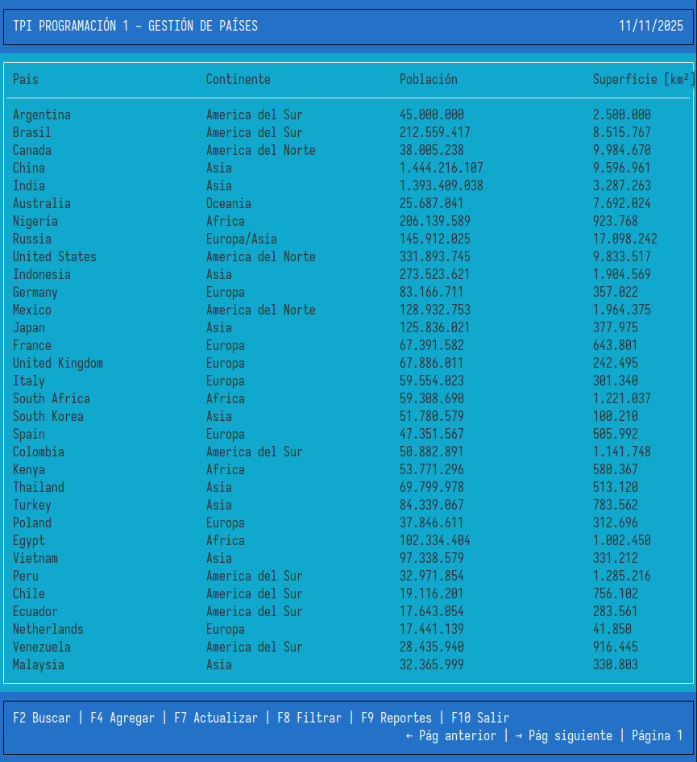
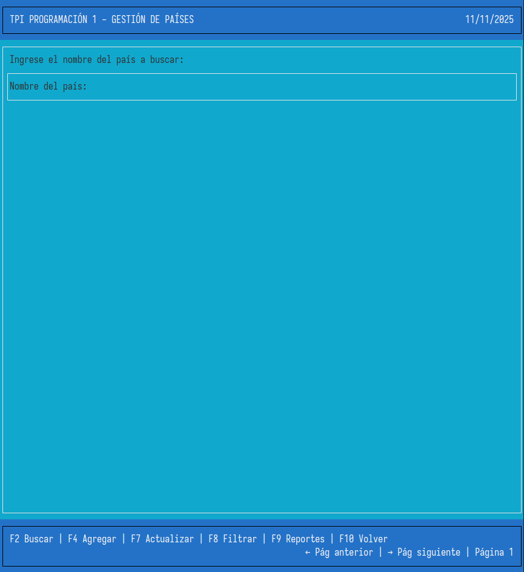
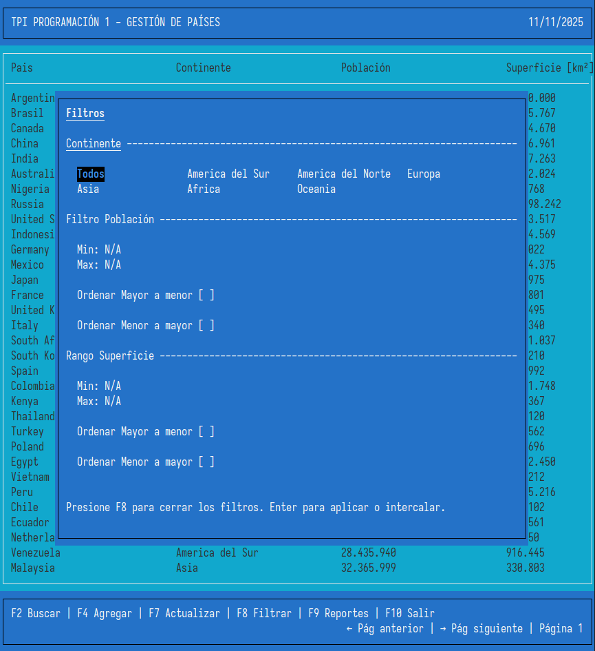
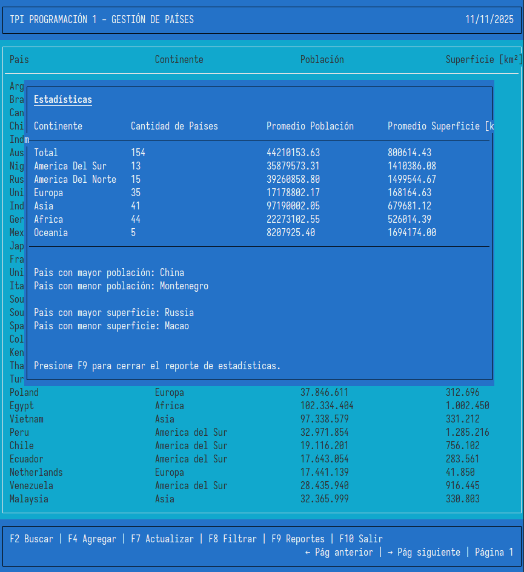

# 🌎 Gestión de Países en Python

## 📘 Descripción del Proyecto

Este trabajo práctico integrador (TPI) forma parte de la materia **Programación 1** de la **Tecnicatura Universitaria en Programación (UTN)**.  
El objetivo del proyecto es desarrollar una aplicación en **Python** que permita **gestionar datos de países** utilizando listas, diccionarios, funciones y manejo de archivos CSV, aplicando filtrados, ordenamientos y estadísticas.

El sistema ofrece una **interfaz interactiva en consola** mediante el módulo `curses`, permitiendo al usuario realizar operaciones de forma intuitiva.

# Módulos del Sistema de Gestión de Países

Este proyecto ahora está organizado en una estructura modular que separa las responsabilidades:

## Estructura del Proyecto

```
TP - Integradores/Programacion/
├── main.py                    # Función main() y start_app() únicamente
├── model.py                   # Lógica de datos y operaciones con archivos
├── paises.csv                # Base de datos de países
├── utilities/                 # Funciones utilitarias de lógica de negocio
│   ├── __init__.py
│   ├── calcular_estadisticas.py
│   ├── reset_esquema_and_values.py
│   ├── editar_registrar_pais.py
│   ├── proceso_carga_datos.py
│   ├── buscar_pais.py
│   ├── lineas_disponibles.py
│   ├── paginas.py
│   ├── filtrar_paises.py
│   └── sorting_functions.py   # Funciones de ordenamiento
└── view/                      # Componentes de interfaz de usuario
    ├── __init__.py
    ├── main_header.py         # Encabezado principal
    ├── main_footer.py         # Pie de página con controles
    ├── main_menu.py           # Lista principal de países
    ├── search_menu.py         # Interfaz de búsqueda
    ├── add_menu.py            # Formulario agregar país
    ├── update_menu.py         # Formulario actualizar país
    ├── filters_menu.py        # Interfaz de filtros
    ├── menu_estadisticas.py   # Reporte de estadísticas
    ├── main_layout.py         # Layout principal completo
    ├── search_layout.py       # Layout de búsqueda completo
    ├── add_layout.py          # Layout agregar completo
    └── update_layout.py       # Layout actualizar completo
```

## Responsabilidades por Módulo

### `utilities/` - Lógica de Negocio

- **Procesamiento de datos**: Carga, filtrado y ordenamiento
- **Validaciones**: Entrada de datos y navegación en formularios
- **Cálculos**: Estadísticas y paginación
- **Utilidades**: Funciones auxiliares reutilizables

### `view/` - Interfaz de Usuario

- **Componentes individuales**: Cada función de interfaz en su propio archivo
- **Layouts completos**: Combinaciones de componentes para pantallas completas
- **Presentación visual**: Todo lo relacionado con curses y visualización
- **Interacción**: Formularios, menús y controles de usuario

### `model.py` - Acceso a Datos

- **CRUD**: Operaciones con el archivo CSV
- **Validación de archivos**: Verificación de integridad
- **Transformaciones**: Conversión y formateo de datos

### `main.py` - Punto de Entrada

- **Función main()**: Bucle principal de la aplicación
- **Función start_app()**: Inicialización y wrapper de curses
- **Coordinación**: Integra todos los módulos

## Ventajas de esta Estructura

1. **Separación de responsabilidades**: Cada módulo tiene un propósito claro
2. **Reutilización**: Las funciones pueden ser importadas y usadas independientemente
3. **Mantenimiento**: Más fácil encontrar y modificar código específico
4. **Testeo**: Cada función puede ser probada de forma aislada
5. **Escalabilidad**: Nuevas funciones pueden agregarse fácilmente
6. **Legibilidad**: Código más organizado y documentado

## Documentación

Cada función incluye:

- **Docstring completo**: Descripción, parámetros y valores de retorno
- **Type hints**: Tipos de datos explícitos
- **Comentarios**: Explicación de lógica compleja cuando es necesario

## 🧩 Funcionalidades Principales

- **Agregar país:** permite registrar un nuevo país validando todos sus campos.
- **Actualizar país:** modifica los datos de población y superficie de un país existente.
- **Buscar país:** búsqueda por nombre (coincidencia parcial o exacta).
- **Filtrar países por:**
  - Continente
  - Rango de población
  - Rango de superficie
- **Ordenar países por:**
  - Población (ascendente o descendente)
  - Superficie (ascendente o descendente)
- **Generar estadísticas:**
  - Cantidad total de países
  - Promedio de población y superficie
  - País con mayor/menor población
  - País con mayor/menor superficie
  - Promedios y cantidad de países por continente

## 🧠 Estructuras de Datos Utilizadas

- **Listas** → para almacenar los registros de países cargados desde el CSV.
- **Diccionarios** → para representar cada país con sus atributos (`nombre`, `poblacion`, `superficie`, `continente`).
- **Funciones** → cada función cumple una única responsabilidad (modularidad completa).
- **Condicionales y Match Cases** → usados para control de flujo y manejo de opciones del usuario.
- **CSV** → archivo base persistente para el almacenamiento de datos.

## ⚙️ Requisitos Técnicos

- Python 3.10 o superior
- Librerías estándar: `curses`, `csv`, `time`, `typing`

> 💡 En sistemas Linux/Unix, `curses` viene preinstalado.

> En Windows, puede instalarse con:

```bash
pip install windows-curses
```

## 🚀 Instrucciones de Uso

1. Clonar el repositorio:

   ```bash
   git clone https://github.com/usuario/gestion-paises.git
   cd gestion-paises
   ```

2. Verificar que exista el archivo `paises.csv`.

3. Ejecutar aplicación

   ```bash
   python3 main.py
   ```

4. Navegar con las siguientes teclas:

| Tecla     | Acción                           |
| --------- | -------------------------------- |
| **F2**    | Buscar / Resetear búsqueda       |
| **F4**    | Agregar país                     |
| **F7**    | Actualizar país                  |
| **F8**    | Mostrar/ocultar filtros          |
| **F9**    | Mostrar/ocultar estadísticas     |
| **← / →** | Cambiar página                   |
| **F10**   | Salir o volver al menú principal |

## 📊 Ejemplo de Datos (`paises.csv`)

```bash
nombre,poblacion,superficie,continente
Argentina,45376763,2780400,America del Sur
Japon,125800000,377975,Asia
Brasil,213993437,8515767,America del Sur
Alemania,83149300,357022,Europa
```

## 🧪 Ejemplo de Ejecución

### Menu principal



### Menu de busqueda



### Filtros



### Estadísticas



## 🧑‍💻 Integrantes

- Juan Ignacio Zapata — Desarrollo, investigación, edición de video.
- Mateo Joaquin Gomez Roggio - Desarrollo, documentacion, creación de archivos.

## 📹 Video de Presentación

> [Enlace al video (YouTube o Drive)]("google.com")

## 📚 Fuentes Bibliográficas

- [Documentación oficial de Python](https://docs.python.org/3/)

- [Real Python – Working with CSV Files](https://realpython.com/python-csv/)

- [W3Schools – Python Dictionaries](https://www.w3schools.com/python/python_dictionaries.asp)

## 🏁 Conclusiones

Este proyecto permitió reforzar conceptos fundamentales de la programación estructurada:

- Uso de listas y diccionarios como estructuras flexibles.

- Importancia de la modularidad en la organización del código.

- Aplicación de filtros, ordenamientos y estadísticas sobre conjuntos de datos.

- Trabajo con archivos CSV como medio de persistencia.

El resultado es una aplicación robusta, funcional y de fácil uso, que demuestra los conocimientos adquiridos a lo largo de la cursada.
